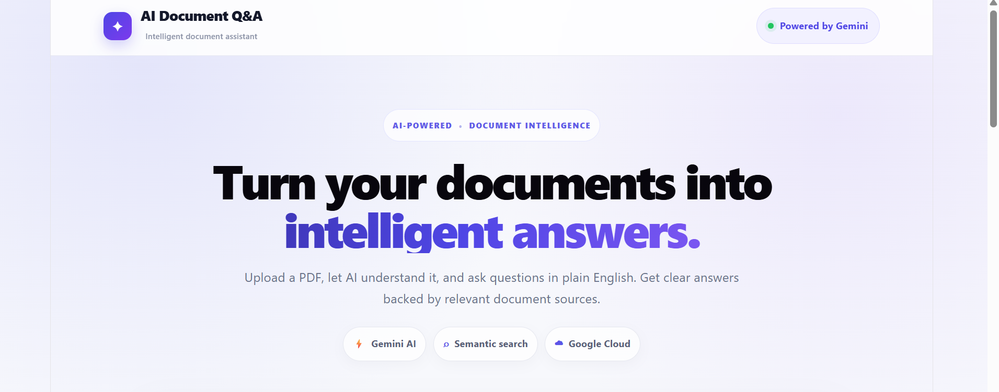
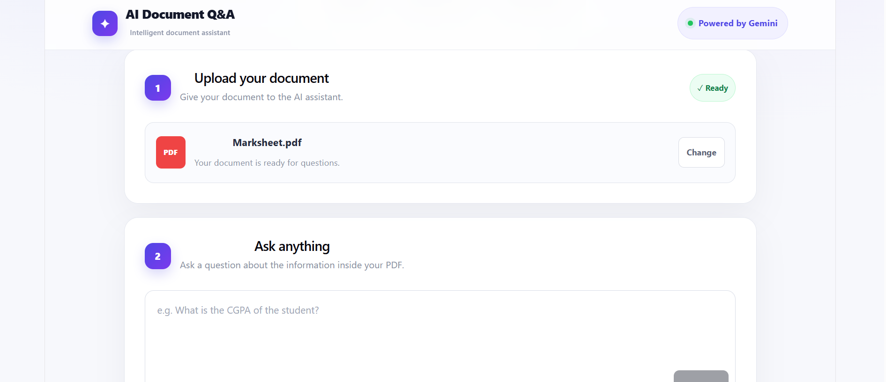
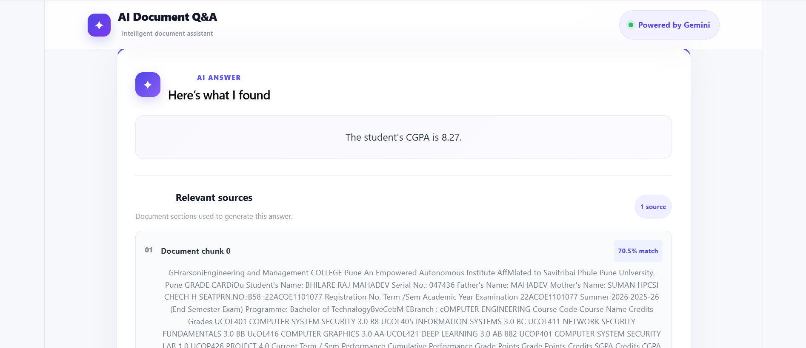

🤖 AI Document Q&A

Ask questions about your PDFs and get AI-powered answers with relevant document sources.

🌐 Live Application

Frontend: https://ai-document-qa-gcp.vercel.app/

The application allows users to upload a PDF, ask multiple questions about it, and view AI-generated answers together with the most relevant document chunks.

✨ Features

📄 Upload PDF documents

🔍 Extract and split document text into chunks

🧠 Generate semantic embeddings using Gemini

☁️ Store PDFs in Google Cloud Storage

🗄️ Store documents, chunks, and embeddings in Firestore

💬 Ask multiple questions about the same document

🤖 Generate answers using Gemini

📚 Display relevant source chunks

📊 Show similarity scores for retrieved sources

👀 Expand and collapse long source text

⚡ Modern responsive React interface

🚀 Production deployment with Vercel + Google Cloud Run

🏗️ Architecture

flowchart LR
    U[👤 User] --> F[React + Vite Vercel]

    F -->|HTTPS| B[FastAPI Google Cloud Run]

    B --> GCS[(Google Cloud Storage)]
    B --> FS[(Cloud Firestore)]
    B --> GEM[Gemini]

    GCS -->|PDF| B
    B -->|Document chunks and embeddings| FS
    FS -->|Relevant chunks| B
    GEM -->|Embeddings + AI answers| B

    B -->|Answer + sources| F

Request flow

PDF Upload
    ↓
React Frontend
    ↓
FastAPI on Cloud Run
    ↓
Google Cloud Storage
    ↓
Text Extraction
    ↓
Text Chunking
    ↓
Gemini Embeddings
    ↓
Firestore

For a question:

User Question
    ↓
FastAPI
    ↓
Question / document retrieval
    ↓
Relevant chunks
    ↓
Gemini
    ↓
AI Answer + Sources
    ↓
React UI

🧠 How the RAG Pipeline Works

This project follows a Retrieval-Augmented Generation style workflow.

1. Upload

The user uploads a PDF through the React frontend.

2. Storage

The PDF is uploaded to Google Cloud Storage.

3. Processing

The backend extracts the document text and divides it into smaller chunks.

4. Embeddings

Gemini generates an embedding for each chunk.

5. Firestore

The document, chunks, and embeddings are stored in Firestore.

6. Question

The user asks a question about the uploaded document.

7. Retrieval

The backend identifies the most relevant document chunks using semantic similarity.

8. Generation

The retrieved context is sent to Gemini to generate the answer.

9. Sources

The frontend displays the answer and the relevant source chunks with similarity scores.

🛠️ Tech Stack

Frontend

React

Vite

JavaScript

CSS

Backend

Python

FastAPI

Uvicorn

Google Cloud client libraries

AI

Gemini

Gemini Embeddings

Retrieval-Augmented Generation (RAG)

Semantic similarity search

Google Cloud

Google Cloud Run

Google Cloud Storage

Google Cloud Firestore

Artifact Registry

Vertex AI / Gemini APIs

Deployment

Vercel

Google Cloud Run

GitHub

📁 Project Structure

ai-document-qa-gcp/
│
├── backend/
│   ├── app/
│   │   ├── routes/
│   │   │   ├── upload.py
│   │   │   └── ask.py
│   │   │
│   │   ├── services/
│   │   │   ├── storage_service.py
│   │   │   ├── firestore_service.py
│   │   │   ├── pdf_service.py
│   │   │   └── embedding_service.py
│   │   │
│   │   ├── config.py
│   │   └── main.py
│   │
│   ├── Dockerfile
│   └── requirements.txt
│
├── frontend/
│   ├── src/
│   │   ├── App.jsx
│   │   ├── App.css
│   │   └── main.jsx
│   │
│   ├── package.json
│   └── vite.config.js
│
└── README.md

🚀 Run Locally

Prerequisites

Python 3.10+

Node.js

Google Cloud project

Google Cloud CLI

Docker (for backend deployment)

Backend

cd backend

Install dependencies:

pip install -r requirements.txt

Start FastAPI:

uvicorn app.main:app --reload --port 8000

Backend:

http://localhost:8000

Health check:

http://localhost:8000/health

Frontend

Open another terminal:

cd frontend
npm.cmd install
npm.cmd run dev

Frontend:

http://localhost:5173

☁️ Google Cloud Deployment

The backend is containerized with Docker and deployed to Google Cloud Run.

Enable required services

gcloud services enable artifactregistry.googleapis.com run.googleapis.com

Create Artifact Registry repository

gcloud artifacts repositories create ai-document-qa `
  --repository-format=docker `
  --location=asia-south1 `
  --description="AI Document Q&A Docker images"

Configure Docker authentication

gcloud auth configure-docker asia-south1-docker.pkg.dev

Build image

docker build -t asia-south1-docker.pkg.dev/PROJECT_ID/ai-document-qa/ai-document-qa-backend:latest .

Push image

docker push asia-south1-docker.pkg.dev/PROJECT_ID/ai-document-qa/ai-document-qa-backend:latest

Deploy to Cloud Run

gcloud run deploy ai-document-qa-backend `
  --image=asia-south1-docker.pkg.dev/PROJECT_ID/ai-document-qa/ai-document-qa-backend:latest `
  --region=asia-south1 `
  --platform=managed `
  --port=8080 `
  --allow-unauthenticated

🔐 Environment Variables

The backend uses environment variables such as:

PROJECT_ID
GOOGLE_CLOUD_PROJECT
BUCKET_NAME
LOCATION

Example:

PROJECT_ID=your-project-id
GOOGLE_CLOUD_PROJECT=your-project-id
BUCKET_NAME=your-bucket-name
LOCATION=asia-south1

Security

Never commit:

.env
*.json
service-account keys
API keys
private keys

Use Google Cloud IAM and service accounts for production authentication.

🖼️ Screenshots

Add screenshots to:

docs/
├── home.png
├── upload.png
├── chat.png
└── sources.png

Then they can be displayed in this README:

Home

Document Chat

Sources

If you do not want to store screenshots in the repository, remove this section.

📊 Google Cloud Components

Service

Purpose

Cloud Run

Hosts the FastAPI backend

Cloud Storage

Stores uploaded PDFs

Firestore

Stores documents, chunks and embeddings

Artifact Registry

Stores Docker images

Gemini

Generates embeddings and answers

Vercel

Hosts the React frontend

🔒 Security & Reliability

Cloud Run uses a Google service account for Google Cloud access.

Cloud Storage and Firestore access is controlled through IAM.

No secret API keys are stored in the frontend.

CORS is configured for the application frontend and local development.

The backend exposes a /health endpoint for service health checks.

🔮 Future Improvements

👤 User authentication

📚 Multiple document management

📑 Page-level PDF citations

💬 Persistent conversation history

⚡ Streaming AI responses

🔎 Improved vector database search

🗑️ Document deletion

📈 Usage monitoring

🛡️ Rate limiting

📱 Further mobile UI improvements

👨‍💻 Author

Raj Bhilare

Computer Engineering | AI • Cloud • Software Development
## 📸 Screenshots

### Home Page

### Document Upload

### AI Answer with Sources

⭐ Why This Project?

This project combines AI, RAG, cloud computing, backend development, frontend development, databases, and container deployment into one end-to-end application.

It demonstrates how a real AI application can move from:

User Interface
      ↓
REST API
      ↓
AI Processing
      ↓
Cloud Storage
      ↓
Database
      ↓
Semantic Retrieval
      ↓
AI Generation
      ↓
Answer + Sources

If you find the project useful, consider giving the repository a ⭐.
